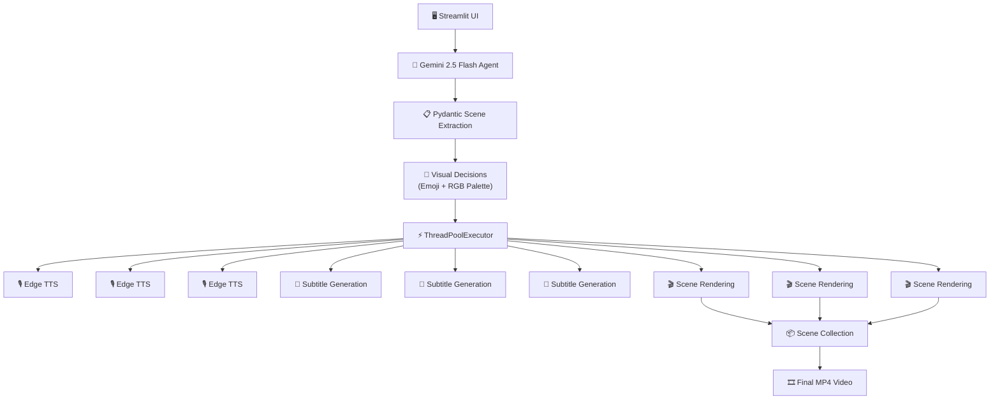

# 🎬 AI Text-to-Video Explainer Agent

> Transformă automat documentația textuală în videoclipuri explicative animate folosind AI Agents, LLMs și procesare media paralelă.


---

## 📖 Overview

**AI Text-to-Video Explainer Agent** este un sistem inteligent bazat pe agenți autonomi și modele de limbaj de mari dimensiuni (LLMs), capabil să transforme descrieri textuale nestructurate (specificații de produs, materiale educaționale, documentație tehnică, PRD-uri etc.) în videoclipuri explicative animate de 2-3 minute.

Sistemul orchestrează întregul pipeline media prin **Tool Calling**, eliminând complet necesitatea:

* Scriptwriting-ului manual
* Înregistrării vocale
* Sincronizării subtitrărilor
* Editării video tradiționale

Rezultatul final este un fișier **MP4 complet sincronizat**, generat automat din text brut.

---

# 🎯 Problema

În mediile Agile și educaționale, informația este distribuită predominant sub formă de documente text.

Această abordare generează multiple probleme:

* 📄 Documentație lungă și greu de parcurs
* ⏱️ Timp mare de înțelegere
* 📉 Retenție scăzută a informației
* 🎥 Costuri ridicate pentru producția video

Crearea unui videoclip explicativ necesită de obicei:

1. Scrierea unui script
2. Înregistrarea narațiunii
3. Crearea vizualurilor
4. Sincronizarea subtitrărilor
5. Editare și randare

Acest proces poate dura ore sau chiar zile.

---

# 💡 Soluția

Agentul AI primește un text brut și execută autonom următorii pași:

1. Analizează documentul
2. Extrage ideile esențiale
3. Împarte conținutul în 5-8 scene logice
4. Generează narațiunea pentru fiecare scenă
5. Creează subtitrări sincronizate
6. Construiește fundaluri vizuale dinamice
7. Compilează și concatenează videoclipul final

Totul este realizat automat prin orchestrarea unui set de unelte specializate.

---

# 🏗️ System Architecture



---

# ⚙️ Workflow

```text
Raw Text
    │
    ▼
Gemini Agent
    │
    ▼
Scene Extraction
    │
    ▼
Parallel Processing
 ┌─────────┬─────────┬─────────┐
 │ Scene 1 │ Scene 2 │ Scene N │
 └─────────┴─────────┴─────────┘
    │
    ├── Audio Generation
    ├── Subtitle Generation
    └── Video Rendering
    │
    ▼
Scene Concatenation
    │
    ▼
Final MP4
```

---

# 🌟 Key Features

## ⚡ Parallel Processing

În loc să proceseze scenele secvențial, sistemul utilizează:

```python
concurrent.futures.ThreadPoolExecutor
```

pentru generarea simultană a:

* Audio
* Subtitrări
* Componente video

Reducând semnificativ timpul total de execuție.

---

## 🧠 Autonomous Visual Decisions

Modelul decide automat:

* Emoji reprezentativ
* Culori RGB contrastante
* Structura vizuală a fiecărei scene

Fără șabloane predefinite.

---

## 🎙️ AI Voice Narration

Utilizează:

```text
Microsoft Edge TTS
```

pentru generarea automată a narațiunii.

---

## 📝 Dynamic Subtitle Synchronization

Motor propriu de subtitrare care:

* împarte textul în grupuri de 6-7 cuvinte
* estimează viteza de vorbire
* generează fișiere `.srt`
* sincronizează la nivel de milisecundă

---

## 🎬 Automatic Video Composition

Construit folosind:

* Pillow
* MoviePy

pentru:

* fundaluri dinamice
* text animat
* subtitrări
* export MP4

---

## 🖥️ Modern User Interface

Interfață construită în:

```text
Streamlit
```

care oferă:

* Upload text
* Progress bars
* Status indicators
* Video preview
* Download rezultat

---

# 🛠️ Tech Stack

| Component              | Technology         |
| ---------------------- | ------------------ |
| LLM                    | Gemini 2.5 Flash   |
| Agent Framework        | LangChain          |
| Validation             | Pydantic           |
| UI                     | Streamlit          |
| TTS                    | Edge TTS           |
| Image Processing       | Pillow             |
| Video Processing       | MoviePy            |
| Concurrency            | ThreadPoolExecutor |
| Environment Management | Python-dotenv      |

---

# 🌍 Sustainable Development Goals (SDGs)

Acest proiect contribuie direct la:

## 🎓 SDG 4 — Quality Education

Transformă materiale educaționale complexe în videoclipuri accesibile și interactive.

---

## 🏭 SDG 9 — Industry, Innovation and Infrastructure

Automatizează procese repetitive de comunicare și documentare în mediul enterprise.

---

# 🚀 Installation

## 1️⃣ Clone Repository

```bash
git clone https://github.com/your-username/ai-text-to-video-agent.git

cd ai-text-to-video-agent
```

---

## 2️⃣ Create Virtual Environment

### Windows

```bash
python -m venv venv

venv\Scripts\activate
```

### Linux / macOS

```bash
python -m venv venv

source venv/bin/activate
```

---

## 3️⃣ Install Dependencies

```bash
pip install -r requirements.txt
```

---

## 4️⃣ Configure Environment Variables

Create a `.env` file:

```env
GOOGLE_API_KEY=your_api_key_here
```

---

## 5️⃣ Run Application

```bash
streamlit run app.py
```

Application will be available at:

```text
http://localhost:8501
```

---

# 📁 Project Structure

```text
.
│
├── app.py
├── requirements.txt
├── .env
├── main_pipeline.ipynb
│
├── data
│   ├── inputs
│   └── outputs
│       ├── audio
│       ├── subtitles
│       └── video
│
└── src
    ├── schemas.py
    ├── video_processing.py
    ├── tools_audio.py
    ├── tools_text.py
    └── tools_video.py
```

---

# 📦 Module Responsibilities

### app.py

Streamlit entry point.

Responsible for:

* User interaction
* Input handling
* Video preview

---

### schemas.py

Pydantic contracts used by the agent.

Defines:

* Scene schema
* Validation rules
* Structured outputs

---

### video_processing.py

Core orchestration layer.

Handles:

* Thread management
* Scene scheduling
* Final assembly

---

### tools_audio.py

Edge TTS integration.

Generates:

```text
.mp3 narration files
```

---

### tools_text.py

Subtitle engine.

Generates:

```text
.srt subtitle files
```

---

### tools_video.py

Video rendering engine.

Responsible for:

* Graphics composition
* Text overlays
* MP4 generation

---

# 📈 Future Improvements

* 🎨 AI generated backgrounds using diffusion models
* 🎬 Transition effects between scenes
* 🌍 Multi-language support
* 🗣️ Multiple voice profiles
* 🎵 Background music generation
* ☁️ Cloud deployment
* 📱 Mobile responsive interface

---

# 🤝 Contributors

Developed as an AI Agent Engineering project focused on:

* Multi-Agent Systems
* Tool Calling
* Media Automation
* Generative AI
* Educational Technology

---

# 📜 License

This project is released under the MIT License.

---

⭐ If you found this project useful, consider giving it a star on GitHub.
